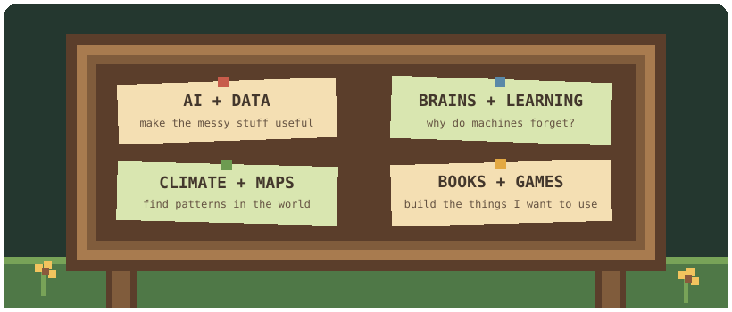

<h1 align="center">Ashar Mehmood</h1>

  <em>AI Engineer · Early Career Researcher</em>

  🗺️ <a href="https://www.linkedin.com/in/asharmehmood">town map</a> ·
  📬 <a href="mailto:asharmehmood99@gmail.com">mailbox</a> ·
  ⛏️ <a href="https://leetcode.com/a_weedy_place">the mines</a> ·
  🕹️ <a href="https://golgaptcha.itch.io">arcade</a>

### 🌱 welcome to the farm

Hey, I’m **Ashar Mehmood** — an AI engineer who likes to build (maybe) useful things, explore odd ideas?, and occasionally wasting my time on a random side quest.

- 🔭 Building with **AI, data, and open-source tools**
- 🌱 Exploring **NeuroAI, climate, medical imaging, maps, and stories**
- 💬 Always happy to talk about a strange idea that might actually work

### 🧰 tool shed

  <picture>
    <source media="(prefers-color-scheme: dark)" srcset="https://skillicons.dev/icons?i=python%2Cpytorch%2Cgo%2Ccpp%2Cpostgres%2Cdocker%2Cfastapi%2Cgit%2Cgithub%2Ckotlin%2Creact%2Cnextjs%2Cgodot&perline=13&theme=dark">
    <source media="(prefers-color-scheme: light)" srcset="https://skillicons.dev/icons?i=python%2Cpytorch%2Cgo%2Ccpp%2Cpostgres%2Cdocker%2Cfastapi%2Cgit%2Cgithub%2Ckotlin%2Creact%2Cnextjs%2Cgodot&perline=13&theme=light">
    
  </picture>

### 📌 quest board

  

No project catalogue here — the Repositories tab already does that job.

### 🔥 keep the crops watered

  

### 🐍 the contribution garden

<picture>
  <source media="(prefers-color-scheme: dark)" srcset="https://raw.githubusercontent.com/A-Weedy-Place/A-Weedy-Place/output/contribution-garden-dark.gif">
  <source media="(prefers-color-scheme: light)" srcset="https://raw.githubusercontent.com/A-Weedy-Place/A-Weedy-Place/output/contribution-garden.gif">
  
</picture>

A tiny garden snake tidies this patch every night.

---

  <i>Thanks for visiting the farm. If you find any bugs, consider them as features 🙂.</i> 🌾

